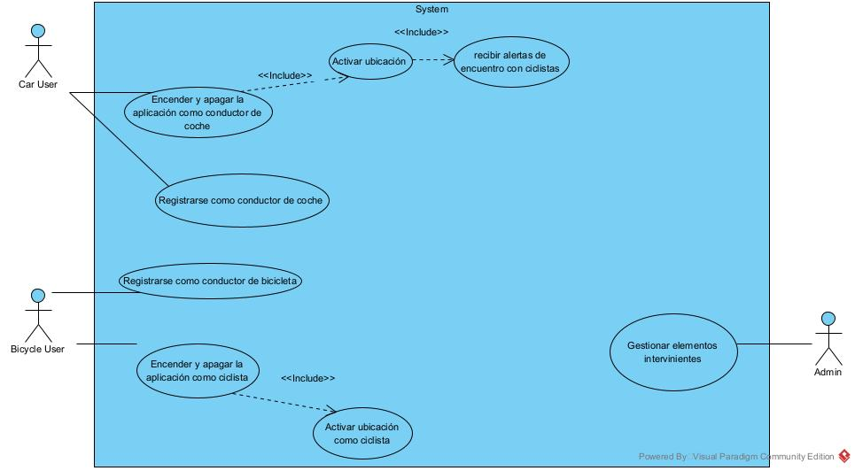
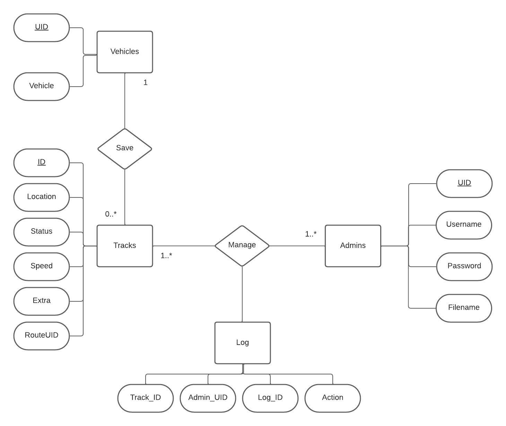
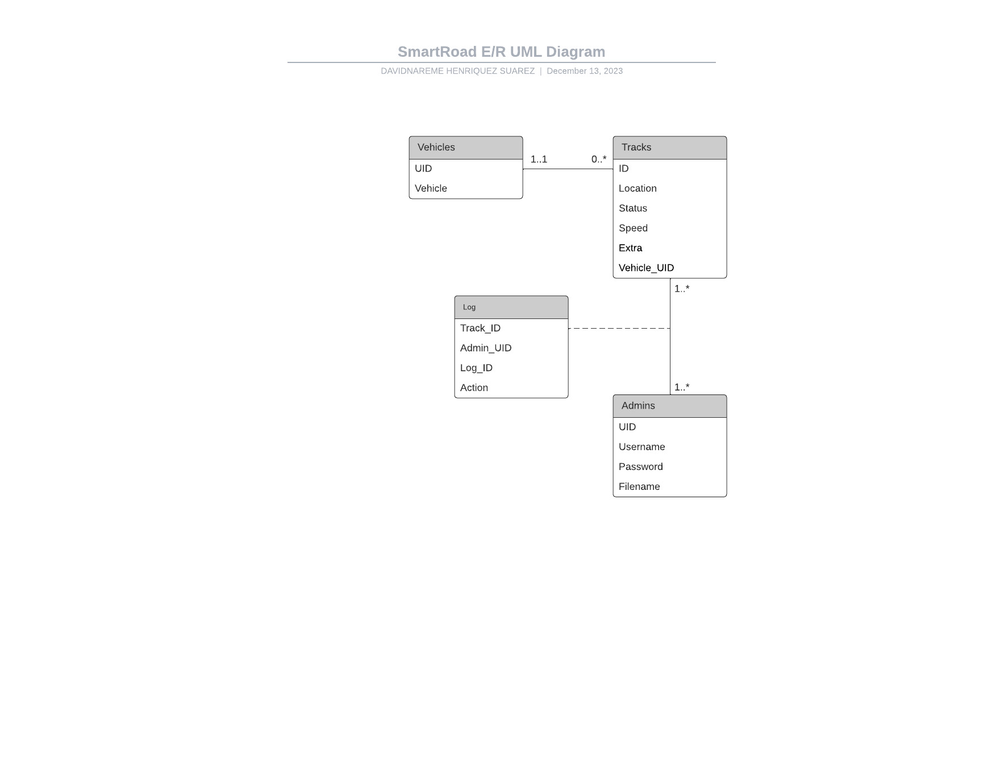
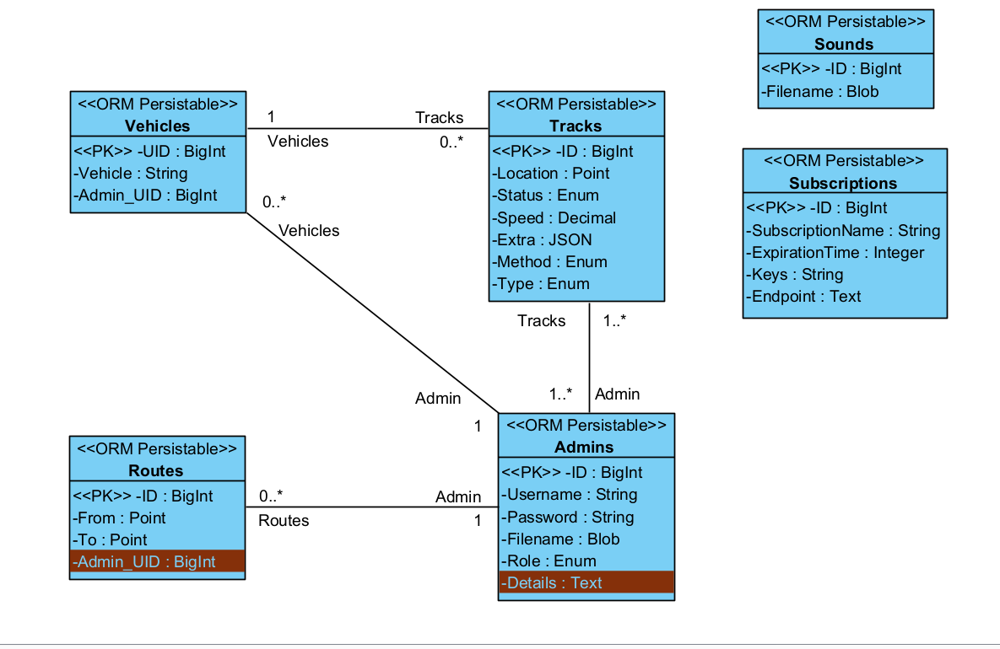
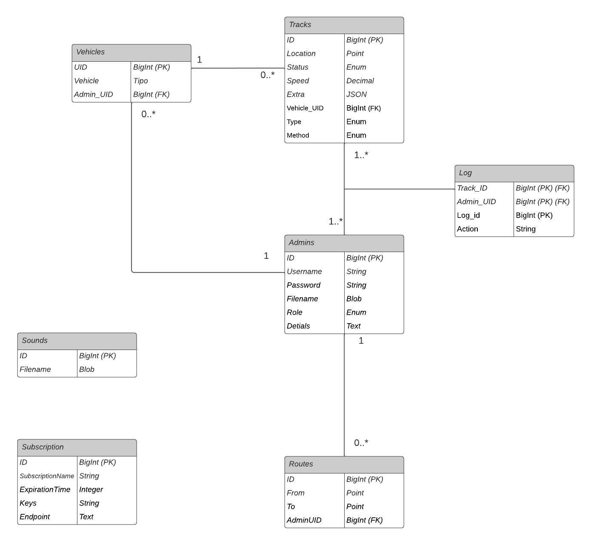

# SmartRoad:

SmartRoad is a project whose purpose is to keep the driver informed of everything that happens around him, constantly saving data on the elements of the road (passive, such as traffic signs, changing, such as traffic lights, and active, such as the vehicles themselves.).

Apart from incorporating a cyclist alert which notifies the car driver when his path matches with that of a cyclist, notifying him of the approximate time of the encounter with the cyclist.

**The company of the project is ITC (Instituto Técnológico de Canarias)**

## Database, its entities and relationships:

These are the database entities that we are using to store all the information for this application to work.

**Vehicles** : This entity has an Unique ID **(UID)**, and the type of vehicle that it is **(Vehicle)**

**Tracks** : This entity has an ID of the track **(ID)**, the location of the track **(Location)**, the status of the vehicle that it tracked **(Status)**, the speed of the vehicle **(Speed)**, a JSON of extra information like an encounter with a bike **(Extra)** and also the Vehicle UID **(Vehicle_UID)**

**Admin** : This entity has and ID of the admin **(ID)**, an username **(Username)**, a password **(Password)** and a filename which is the profile picture **(Filename)**

**Logs** : This entity has and ID of the log **(Log_ID)**, an id of the admin that made an action on a track **(Admin_UID)**
In our database, we assume that an admin (in this case the is an administrator since a common user does not require to login and is anonymous) can manage many tracks and a track can be managed by several administrators. Also, a vehicle can send many tracks and a track only belongs to one vehicle.

## Use Case Diagram

I made this Use Case Diagram to have an idea of all the things that our app can do:



## E/R, UML, Class and Relational Diagrams

According to the previous Entities and Relationships that I explained before, here are the E/R, UML, Class and Relational Diagrams:

**E/R**


**UML**


**Class**


**Relational**



## Describe the operation of the system and technical specifications for the server application and the mobile and web APPs

The SmartRoad system operates by constantly collecting and storing data related to road elements, such as vehicles. It provides real-time information to drivers and incorporates a cyclist alert system to notify car drivers when their path intersects with a cyclist, along with an estimate of the encounter time.

## Interface

The interface of the app it's really simple, for the user, two buttons where you decide who you are, and the it send you notifications in case that you are a car driver user, also you have an admin view with some tables where you can manage the data. Below, you have some screenshots of the interface of the app:

### User interface:
This is the home page:


If you log as a car it appears this interface:


And if you log as a bike it appears this interface:


We also added a sound selector, where you can select a notification sound in case that you are a
car driver:


Another new feature is that we added a multilanguage support (we just added english and spanish for now), which allows you to change the language between spanish and english in every page of the API:


That's how it looks like if you change it to spanish:


### Admin interface:
When you try to enter as an admin, it will apear a login page as the following:


Then if you enter succesfully, you will have access to every table of the database (only the Admin table as an example is shown)


Also we added a map on the tracks where you can difference a bicycle from a car by looking at their marks (bicycles are marked in blue and cars in red)


Apart of that, if you make 2 tracks with the same vehicle, the app will recognise it and will mark it with a blue line:


We added some reports using JsReport, below, you have a pdf with a installation manual to use this feature in your device:


Also we added websockets with the idea of warn every user in broadcast from an admin. That's how it 
looks like in the admin and user interface:


## Initial Design

My initial design of the application was thinking of a menu with 2 simple buttons, one with a bicycle where you register as a cyclist, and another with a car where you register as a car driver, apart from another more hidden button than the car and bike buttons where you can log in as administrator and access all the data in the database, and I used this idea to the end. My idea is reflected in the following link:

https://www.figma.com/file/rFNs70rKThQkLl0Nqc9rYP/Untitled?type=design&node-id=0%3A1&mode=design&t=jRCTMx0RnjMFJu7F-1

## Usability and Accesibility

### Usability Aspects:
1. Navigation:

    _Justification:_ Intuitive navigation is crucial for user satisfaction. The interface offers clear buttons and pathways for users to select their role or access admin features.
   
   _Example:_ The home page is the best example of this aspect, we have 2 buttons that indicates clearly where are them redirecting to

   


2. Consistency:

    _Justification:_ Consistent design elements and placement create a familiar user experience. Buttons and layouts maintain uniformity throughout the application.
   
   _Example:_ When selecting the car driver button, the interface continues to maintain the same general layout and offers a consistent experience with the home page.
   
   
   

    
3. Readability:

    _Justification:_ Legible fonts, appropriate font sizes, and a well-chosen color scheme enhance readability, catering to users with visual impairments or reading difficulties.
   
   _Example:_ The car or bike page is a perfect example for this aspect, we have a really clear text telling you what is it function and what is going to make the app
   
   


4. Match Between the System and the Real World

    _Justification:_ The desing uses words, phrases and concepts familiar for the user.

    _Example:_ We use a common and simply use of the jargon for tell about what happening, and whats
gonna happen


5. User Control and Freedom

   _Justification:_ We make a clearly marked botton for cancel or go back on the transaction, to leave the unwanted action.

   _Example:_ A left arrow on the top left of the screen that allow the user going back on the instruction

   


6. Aesthetic and Minimalist Desing

   _Justification:_ The interface abstent of irrelevant information and content all the necesary information on it.

   _Example_: The principal view of the API use a limited color palette, and efficient use of space. It presents only the necessary elements 


7. Help and Documentation:

    _Justification_: The API don't need additional explation and the documentation to help users its easy to find.

   _Example:_ The API is very intuitive and if you need a user manual it is easy to find. It is on the main page of the API and is an option that says "Need help?"

   


8. Instant Feedback:

    _Justification:_ Add instant confirmation for the actions of the user.

   _Example:_ At the begining of the API we have a spring that show us the action of uploading the API data, when it finish we can see the API.

   imagen


9. Multilingual support

    _Justification:_ Multilingual support in an API improves accessibility by removing language barriers and enhances usability by allowing interaction in the user’s preferred language.

   _Example:_ An API for a global e-commerce platform could accept requests and return responses in multiple languages, making it more accessible and user-friendly.

   English option allowed
    

   Spanish option allowed
    


## Accessibility Aspects:

1. Keyboard Navigation:

    _Justification:_ Supporting keyboard navigation is crucial for users who rely on keyboard input or assistive technologies.
   
   _Example:_ An example of this aspect is in the forms of the admin view, you can navigate through the fields with the keyboard
   
   


2. Color Contrast:

    _Justification:_ A carefully chosen color scheme and contrast ratios improve visibility for users with visual impairments.
   
   _Example:_ The admin view is a good example of this aspect, since it has a contrast between all the features
   
   


3. Alternative Text on images:

    _Justification:_ Add a alternative text fot the images for the people whit visual disability.

   _Example:_ Using the "alt" on the image for describe on short phrase whats the image.

   


4. Descriptive Links:

   _Justification:_ They provide clear information about the link destination, aiding users of screen readers to navigate more easily and comprehend content without confusion.

   _Example:_

   ```sh
    <a className='help' href='/html/Introduction.html'>{t('Need help?')}</a>
    ```
   
    


5. Multilingual support

    _Justification:_ Multilingual support in an API improves accessibility by removing language barriers and enhances usability by allowing interaction in the user’s preferred language.

   _Example:_ An API for a global e-commerce platform could accept requests and return responses in multiple languages, making it more accessible and user-friendly.

   English option allowed
    

   Spanish option allowed
    


## Manuals of installation
The steps for installing this app are the following:

### Step one: Cloning the repository
```sh
git clone https://github.com/nareesuarezz/SmartRoad/
```
### Step two: Installing the dependencies of both backend and frontend
```sh
cd SmartRoad/backend
npm install

cd SmartRoad/frontend
npm install
```

### Step three: Running both backend and frontend
```sh
cd SmartRoad/backend
npm start

cd SmartRoad/frontend
npm start
```

## User Manual
Here in the pdf you have the user manual of the app


## Technology Stack:

### Backend (Server):
-Node.js: JavaScript runtime for server-side execution.

-Express.js: Node.js framework for building web applications and APIs.

-Sequelize: ORM (Object-Relational Mapping) for managing SQL databases, specifically for MySQL.

-MySQL: Relational database for storing system information.

-JSON Web Tokens (JWT): For authentication and token generation.

### Frontend (Web Client):
-React: JavaScript library for building user interfaces.

-Axios: HTTP client for making requests to the server.

### Development and Version Control Tools:
-Git: Version control system.

-GitHub: Collaboration platform using Git.

-npm: Package management system for Node.js.

## Technology Comparison

My project stands out as a web application, crafted with a responsive design approach to ensure adaptability across diverse platforms. The decision to opt for a web-based solution stems from several reasons, positioning it as a superior choice when compared to other types of technologies. I think that is really interesting to use this type of applications because of the advantages of web applications over traditional applications or client-server type software are very numerous one of them are scalability: The web applications can be scaled easily. That is, additional functions can be integrated progressively and in a simple way. Another example is that they doesn't need to be installed, you can use them whenever you want without wasting storage of your device, making it more confortable to use. Below I have some advantages and disadvantages of all technologies (including the Web Apps):

## Native Apps:

**Advantages:**
- **Optimized Performance:** Native apps run really fast because they're tailor-made for each platform.
- **Full Access to Features:** They can use all the cool features of your device, like sensors and cameras.
- **Customized Interface:** Looks and feels just right on your device, following its design rules.

**Disadvantages:**
- **Costly and Slow Development:** Takes more time and money to create separate versions for iOS and Android.
- **Slow Updates:** Adding new features is slower because updates need approval from app stores.
- **Limited to Specific Devices:** Only works on certain types of phones, leaving out others.

## Hybrid Apps:

**Advantages:**
- **Cross-Platform Development:** Saves time and money by using the same code for different platforms.
- **Access to Native Features:** Can use native device features for a better user experience.
- **Quick Updates:** Updates can be done fast without waiting for app store approval.

**Disadvantages:**
- **Less Performance:** Might not be as fast, especially for graphics-heavy apps.
- **Limits in Native Features:** Some cool phone features might be harder to use or not work as well.
- **Dependent on Frameworks:** How good it is depends a lot on the tools used, which could limit what you can do.

## Web Apps:

**Advantages:**
- **Rapid and Economical Development:** Quick and cheap to make and update through browsers.
- **Cross-Platform Compatibility:** Works on any device with a browser, making it accessible to everyone.
- **Easy Maintenance:** Updates and fixes are easy to do through the web.

**Disadvantages:**
- **Limits in Native Features:** Can't use all the cool features of your phone.
- **Less Performance:** Might not run as fast, especially for complicated apps.
- **Needs Internet Connection:** Requires the internet to work, which can be a problem if the connection is bad.

## Progressive Web Apps (PWA):

**Advantages:**
- **Cross-Platform Compatibility:** Feels like a native app on different platforms.
- **Offline Capabilities:** Works even without internet, which is great in areas with bad connections.
- **Easy Updates:** Can be updated quickly without waiting for app store approval.

**Disadvantages:**
- **Limits in Native Access:** Can't use all the features of the phone.
- **User Engagement:** Some people might prefer using a full native app.
- **Limited Performance:** Might not be as fast as native apps for everything.


## Repository:
https://github.com/nareesuarezz/SmartRoad

## Planification

For the planification, I started doing a repository on GitHub, and I made a develop branch, and I made local branches for specifical issues that I was finding and putting them into my project backlog, where I was putting there my main objectives each week, using this method, I could reach my objective week per week until now. Apart of this method, I didn't know at first how to start, so I started developing the main features that I knew that I had to make obligatory, first with the backend, and then when I was getting more ideas, I started developing at the same time both backend and frontend, I had the most problems in the backend, so in my planification, I ended first the frontend to focus in the backend then. To fix my backend I took a while but at least, I could complete it.

## Conclusion, opinions, reflections

In my opinion, it has been quite a cumbersome job since I have faced many problems that have made me lose a week to solve it, but despite all the errors I have been able to move forward to be able to deliver this project. This has been for me like an introduction to true reality, and I have taken it as a test to check my ability to work under pressure. 


