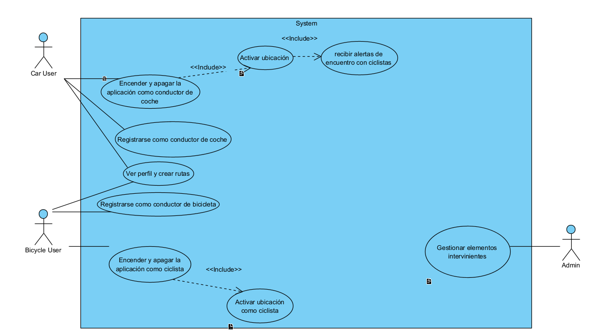

# SmartRoad:

SmartRoad is a project whose purpose is to keep the driver informed of everything that happens around him, constantly saving data on the elements of the road (passive, such as traffic signs, changing, such as traffic lights, and active, such as the vehicles themselves. ).

Apart from incorporating a cyclist alert which notifies the car driver when his path coincides with that of a cyclist, notifying him of the approximate time of the encounter with the cyclist.

## Database, its entities and relationships:

These are the database entities that we are using to store all the information for this application to work.

**Vehicles** : This entity has an Unique ID **(UID)**, and the type of vehicle that it is **(Vehicle)**

**Tracks** : This entity has an ID of the track **(ID)**, the location of the track **(Location)**, the status of the vehicle that it tracked **(Status)**, the speed of the vehicle **(Speed)**, a JSON of extra information like an encounter with a bike **(Extra)** and also the Vehicle UID **(Vehicle_UID)**

**Admin** : This entity has and ID of the admin **(ID)**, an username **(Username)**, a password **(Password)** and a filename which is the profile picture **(Filename)**

**Logs** : This entity has and ID of the log **(Log_ID)**, an id of the admin that made an action on a track **(Admin_UID)**
In our database, we assume that an admin (in this case the is an administrator since a common user does not require to login and is anonymous) can manage many tracks and a track can be managed by several administrators. Also, a vehicle can send many tracks and a track only belongs to one vehicle.

### Use Case Diagram

I made this Use Case Diagram to have an idea of all the things that our app can do:

### E/R, UML, Class and Relational Diagrams

According to the previous Entities and Relationships that I explained before, here are the E/R, UML, Class and Relational Diagrams:

##E/R

##UML

##Class

##Relational

