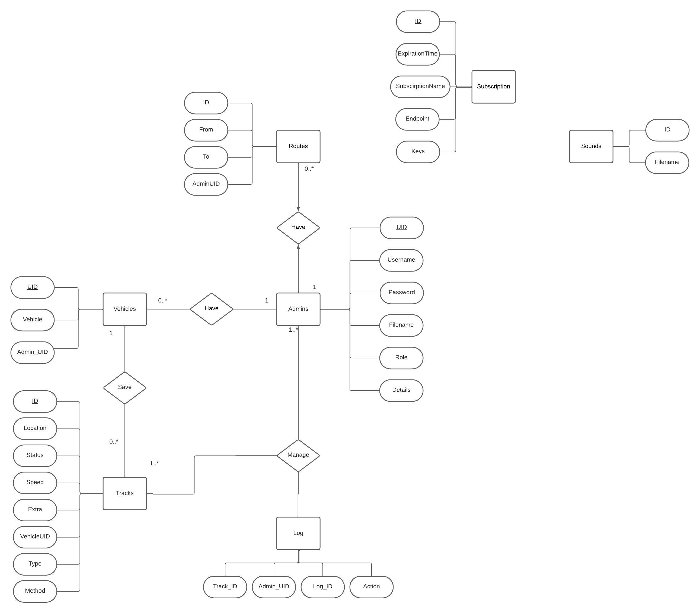
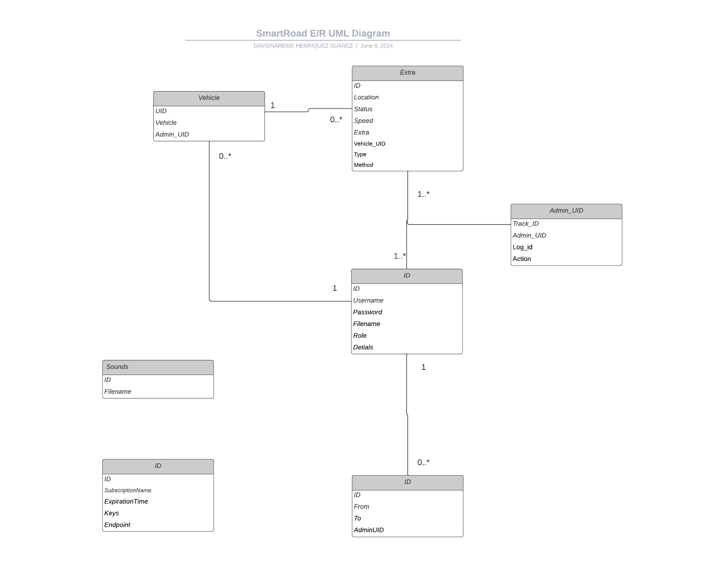

# SmartRoad:

SmartRoad is a project whose purpose is to keep the driver informed of everything that happens around him, constantly saving data on the elements of the road (passive, such as traffic signs, changing, such as traffic lights, and active, such as the vehicles themselves.).

Apart from incorporating a cyclist alert which notifies the car driver when his path matches with that of a cyclist, notifying him of the approximate time of the encounter with the cyclist.

**The company of the project is ITC (Instituto Técnológico de Canarias)**

## Database, its entities and relationships:

These are the database entities that we are using to store all the information for this application to work.

**Vehicles** : This entity has an Unique ID **(UID)**, and the type of vehicle that it is **(Vehicle)**

**Tracks** : This entity has an ID of the track **(ID)**, the location of the track **(Location)**, the status of the vehicle that it tracked **(Status)**, the speed of the vehicle **(Speed)**, a JSON of extra information like an encounter with a bike **(Extra)** and also the Vehicle UID **(Vehicle_UID)**

**Admin** : This entity has and ID of the admin **(ID)**, an username **(Username)**, a password **(Password)** and a filename which is the profile picture **(Filename)**

**Logs** : This entity has and ID of the log **(Log_ID)**, an id of the admin that made an action on a track **(Admin_UID)**
In our database, we assume that an admin (in this case the is an administrator since a common user does not require to login and is anonymous) can manage many tracks and a track can be managed by several administrators. Also, a vehicle can send many tracks and a track only belongs to one vehicle.

## Use Case Diagram

I made this Use Case Diagram to have an idea of all the things that our app can do:


## E/R, UML, Class and Relational Diagrams

According to the previous Entities and Relationships that I explained before, here are the E/R, UML, Class and Relational Diagrams:

**E/R**


**UML**


**Class**


**Relational**


## Describe the operation of the system and technical specifications for the server application and the mobile and web APPs

The SmartRoad system operates by constantly collecting and storing data related to road elements, such as vehicles. It provides real-time information to drivers and incorporates a cyclist alert system to notify car drivers when their path intersects with a cyclist, along with an estimate of the encounter time.

## Interface

The interface of the app it's really simple, for the user, two buttons where you decide who you are, and the it send you notifications in case that you are a car driver user, also you have an admin view with some tables where you can manage the data. Below, you have some screenshots of the interface of the app:

### User interface:
This is the home page:


If you log as a car it appears this interface:


And if you log as a bike it appears this interface:


### Admin interface:
When you try to enter as an admin, it will apear a login page as the following:


Then if you enter succesfully, you will have access to every table of the database (only the track table as an example is shown)


## Initial Design

My initial design of the application was thinking of a menu with 2 simple buttons, one with a bicycle where you register as a cyclist, and another with a car where you register as a car driver, apart from another more hidden button than the car and bike buttons where you can log in as administrator and access all the data in the database, and I used this idea to the end. My idea is reflected in the following link:

https://www.figma.com/file/rFNs70rKThQkLl0Nqc9rYP/Untitled?type=design&node-id=0%3A1&mode=design&t=jRCTMx0RnjMFJu7F-1

## Usability and Accesibility

### Usability Aspects:
1. Navigation:

    _Justification:_ Intuitive navigation is crucial for user satisfaction. The interface offers clear buttons and pathways for users to select their role or access admin features.
   _Example:_ The home page is the best example of this aspect, we have 2 buttons that indicates clearly where are them redirecting to 


2. Consistency:

    _Justification:_ Consistent design elements and placement create a familiar user experience. Buttons and layouts maintain uniformity throughout the application.
   _Example:_ 

4. Readability:

    _Justification:_ Legible fonts, appropriate font sizes, and a well-chosen color scheme enhance readability, catering to users with visual impairments or reading difficulties.
   _Example:_ The car or bike page is a perfect example for this aspect, we have a really clear text telling you what is it function and what is going to make the app:
   


## Accessibility Aspects:

1. Keyboard Navigation:

    _Justification:_ Supporting keyboard navigation is crucial for users who rely on keyboard input or assistive technologies.
   _Example:_ An example of this aspect is in the forms of the admin view, you can navigate through the fields with the keyboard
   


2. Color Contrast:

    _Justification:_ A carefully chosen color scheme and contrast ratios improve visibility for users with visual impairments.
   _Example:_ The admin view is a good example of this aspect, since it has a contrast between all the features
   

## Manuals of installation
The steps for installing this app are the following:

### Step one: Cloning the repository
```sh
git clone https://github.com/nareesuarezz/SmartRoad/
```
### Step two: Installing the dependencies of both backend and frontend
```sh
cd SmartRoad/backend
npm install

cd SmartRoad/frontend
npm install
```

### Step three: Running both backend and frontend
```sh
cd SmartRoad/backend
npm start

cd SmartRoad/frontend
npm start
```

## User Manual
Here in the pdf you have the user manual of the app


## Technology Stack:

### Backend (Server):
-Node.js: JavaScript runtime for server-side execution.

-Express.js: Node.js framework for building web applications and APIs.

-Sequelize: ORM (Object-Relational Mapping) for managing SQL databases, specifically for MySQL.

-MySQL: Relational database for storing system information.

-JSON Web Tokens (JWT): For authentication and token generation.

### Frontend (Web Client):
-React: JavaScript library for building user interfaces.

-Axios: HTTP client for making requests to the server.

### Development and Version Control Tools:
-Git: Version control system.

-GitHub: Collaboration platform using Git.

-npm: Package management system for Node.js.

## Technology Comparison:

## Native Apps:
### Advantages:
-Access to device-specific features for enhanced performance.

-Optimal user experience tailored to the platform.

### Disadvantages:
-Requires separate development for different platforms.

-Longer development time and higher costs.

## Hybrid Apps:
### Advantages:
-Cross-platform development, reducing development time and costs.

-Access to device features through plugins.

### Disadvantages:
-May not match the performance of native apps.

-Limited access to some native features.

## Web Apps:
### Advantages:
-Cross-platform compatibility without the need for separate development.

-Easier maintenance and updates.

### Disadvantages:
-Limited access to device-specific features.

-Potentially lower performance compared to native apps.

## Progressive Web Apps (PWA):
### Advantages:
-Offline capabilities and responsive design.

-No need for installation through app stores.

### Disadvantages:
-Limited access to some native features.

-May not provide the same level of user engagement as native apps.

## Planification

For the planification, I started doing a repository on GitHub, and I made a develop branch, and I made local branches for specifical issues that I was finding and putting them into my project backlog, where I was putting there my main objectives each week, using this method, I could reach my objective week per week until now.

## Conclusion, opinions, reflections

In my opinion, it has been quite a cumbersome job since I have faced many problems that have made me lose a week to solve it, but despite all the errors I have been able to move forward to be able to deliver this project. This has been for me like an introduction to true reality, and I have taken it as a test to check my ability to work under pressure. 


